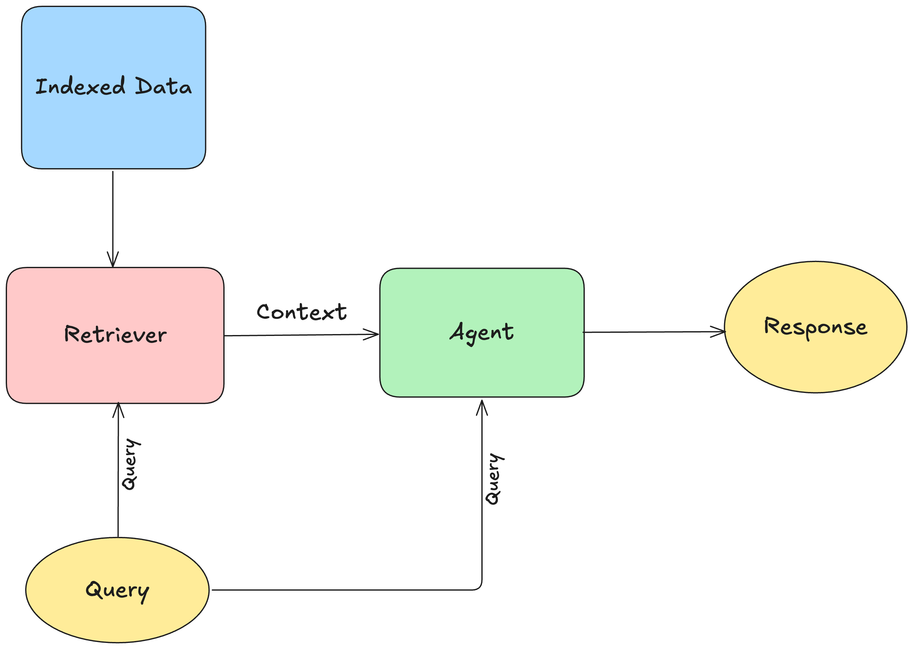

# Simple RAG – Minimal Retrieval-Augmented Generation API

This project implements a **minimal Retrieval-Augmented Generation (RAG) API** with FastAPI that answers questions from the *WHO World Health Statistics 2024* report.  

It uses **ChromaDB** for retrieval and **Google Gemini** for generation. A small **load-testing script** is also included to fire 5 concurrent queries against the API and measure execution time.



## Highlights
- Parse and chunk PDF content
- Create embeddings and store in Chroma DB
- Retrieve top‑k context for user queries
- Generate answers using provided system prompts and an LLM client

## Quick start (run notebook first)
The notebook performs one‑time setup to parse the PDF and build the index. Run it before any scripts.

## Repository layout

```
config.py                # Configuration and constants
create_client.py         # Model/client factory
get_embedding_model.py   # Embedding model initialization
indexing.py              # Build the vector index (ingestion)
main.py                  # Simple CLI / entrypoint
parser.py                # PDF parsing + chunking utilities
process_query.py         # Retrieval + generation loop
images/                  # Diagrams and course figures
parsed_results/          # Intermediate parsed outputs (ignored)
pdf/                     # Source PDFs for ingestion
chroma_db/               # Local Chroma vector store (ignored)
notebook.ipynb           # Parse PDF and Generate Index
requirements.txt         # Python dependencies
system_prompts.py        # System prompt(s) for the agent
```

## Prerequisites
- Python 3.10+
- macOS/Linux/Windows

## Setup
```bash
uv venv
source .venv/bin/activate 
uv pip install -r requirements.txt
```

## Parse PDF and Build Index
```bash
notebook.ipynb
```

## Environment variables
Create a .env file and provide the following:
```bash
LLAMA_PARSE_API_KEY=<>
GEMINI_API=<>
```

## Entrypoint
Start FastAPI server
```bash
python main.py
```
## YouTube Video
📺 Watch the full walkthrough on [YouTube](https://youtu.be/bHqbWIF3BmU)

## Code Architecture
📖 For a detailed explanation of the project’s architecture, check out [Codalogy](https://codalogy.com) → **Simple RAG**


